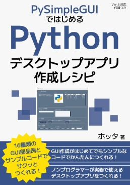
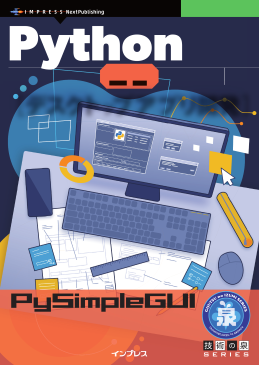

# book-PySimpleGUI

技術同人誌「PySimpleGUIではじめる：Pythonデスクトップアプリ作成レシピ」と、インプレスNextPublishingの「Pythonで始める簡単デスクトップアプリ開発　PySimpleGUI入門」のサンプルコードおよび参考資料用リポジトリです。




---

## PySimpleGUIについての重要なお知らせ

2025年2月末で、PySimpleGUIライブラリが開発中止となりました。ただし、PySimpleGUIの無料版を引き継いだFreeSimpleGUIというライブラリで、同等の機能が引き続き使用できます。

今後、新たに本書籍のコードを実行したい場合は、以下を読み替えてご使用ください。

### ライブラリ名

PySimpleGUI → FreeSimpleGUI

### 1.4章 インストール⽅法

Windowsの公式Python環境

```txt
python -m pip install pysimplegui
　↓  
python -m pip install FreeSimpleGUI
```

Linux, macOSの公式Python環境

```txt
python3 -m pip install pysimplegui
　↓  
python3 -m pip install FreeSimpleGUI
```

Anaconda環境は2025年3月時点では対応していません

### 各章のコードのimport文を以下のように修正

```py
import PySimpleGUI as sg
　↓
import FreeSimpleGUI as sg
```

本リポジトリのサンプルコードを、FreeSimpleGUIに対応して追加しました。（フォルダ名：SamplePrograms_FreeSimpleGUI）

### 現在PySimpleGUIをインストールしてお使いの方

引き続きPySimpleGUIは使用できますが、バージョンとライセンス形態により、将来的に使えなくなる可能性があります。

- 個人でHobbyistライセンス登録をしてVer5台をインストールしている方  
→ライセンスが切れるまで（登録から1年間）は使用可能ですが、それ以降は使用不可
- ライセンス登録せずにVer4台をインストールしている方  
→インストール済みのものは今後もずっと使えますが、PC入れ替えなどでのライブラリ再インストールは不可
- 有料の商用ライセンス登録をしている方  
→引き続き使用可能

---

## コンテンツ一覧

- SamplePrograms : 本書に掲載されているサンプルコードを格納しています（PySimpleGUI版）
- SamplePrograms_FreeSimpleGUI : 本書に掲載されているサンプルコードを格納しています（FreeSimpleGUI版）
- 付録_バージョン5対応方法.pdf : バージョン5対応の手順を記載しています（2025年2月で個人向け無料ライセンスが廃止されたので、現在対応不可。FreeSimpleGUIをお使いください）
